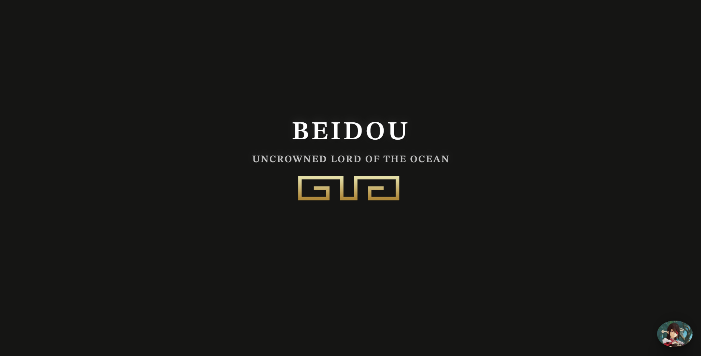

# Genshin Character Pages
 

    <a href="https://puzonevan.github.io/Genshin-Character-Pages/">Live Demo</a>

# Overview 
There are plenty of information sites about Genshin Impact, the characters, game statistics, etc. However, my information sites about the characters in the game focuses on **only the characters** and showcases only what most players need which are **materials**, **builds**, and **ability descriptions**. 

The link above sends you to a hub containing to the current characters with dedicated pages. Clicking on a character sends you to their dedicated page. 

# Design 
## Title
The title section includes the ***name*** of the character as the main title, a ***sub title***, and sometimes a ***randomized quote*** by the character

## Materials
This section includes the necessary ***materials*** and ***amounts*** in order to ***level up*** the character and their ablities to the max 

## Builds
There are two builds containing ***weapons*** and ***artifacts*** that the character should use in the game

## Abilities
This section includes ***abilities***(including ***passives***) and ***constellations*** of the character

## Artwork
Lastly, why not include some ***fan art*** of the character. 

# Features
- Randomized quotes on refresh 
- Custom made svg images
- Links to all materials, weapons, artifacts, etc.
- Change material amounts based on level(TBA)

# What have I learned? 
- Fetch API 
- Creating custom svg's 
- Lighthouse performance, accessibility, and best practices
- Color palettes 

# Background
This project started out with only one character: [Ganyu](https://puzonevan.github.io/Ganyu/). After **2-3 months** finishing this site, I attempted to create another character site for a different character: [Raiden Shogun](https://puzonevan.github.io/RaidenShogun/). This took around **half a month** compared to the previous site since most of the previous code was used. However, in order to create a site for every character, I needed a different approach.

I implemented the ***fetch api*** in order to acquire all of the data I needed. The data I utilized came from [Genshin DB](https://github.com/theBowja/genshin-db). Additionally, I ***reformated*** the HTML, CSS, and JS to be more universal due to **bad** and **lazy** practices on the [Ganyu](https://puzonevan.github.io/Ganyu/) site. 

Now, the only manual things needed to be done are **gathering fan art** which is often enjoyable, **choosing a funny gif** for the menu icon, **customizing the color palette**, and **changing the js data** to the approriate character, materials, and such.

There are plenty of other and faster solutions such as a React site and split everything into small components, but I wanted to stick to a small web stack of pure HTML, CSS, and JS in order to gain more mastery and explore new things. 

# Credits
[Genshin gg](https://genshin.gg/) | [Game8](https://game8.co/games/Genshin-Impact) | [Genshin Wiki](https://genshin-impact.fandom.com/wiki/Genshin_Impact_Wiki)
- General information, builds, descriptions, etc.

[Genshin DB](https://github.com/theBowja/genshin-db) 
- Genshin data and image links for Fetch API 